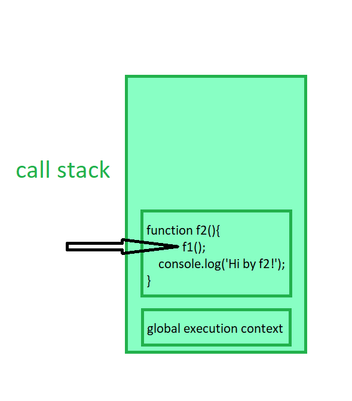

# JavaScript Overview

## Scripting Language
JavaScript is a scripting language that enables you to dynamically update content, control media, and create animated images.

### Types of Execution:
- **Synchronous Language**: 
  - Tasks are performed sequentially, meaning one task must complete before the next starts.
  - Execution blocks until the current task finishes.
  - Example: Waiting in a queue, reading a file sequentially.
  
- **Asynchronous Language**:
  - Tasks can run independently of one another.
  - A task can start before the previous task is finished.
  - Non-blocking execution, tasks can run in parallel or handle delays (e.g., waiting for data).
  - Example: Sending a message and continuing other tasks without waiting for a reply.

**Ideal for input/output operations, network requests, and any task that involves waiting.**

### Execution Context in JavaScript
Everything in JavaScript happens inside an execution context.

JavaScript is a **synchronous** (specific order) **single-threaded** (executes one command at a time) language.

#### Key Concepts of Execution Context:
1. **Creation Phase and Execution Phase**:
    - **Creation Phase**: Memory is allocated for variables and functions; variables are initialized with `undefined`.
    - **Execution Phase**: Code is executed line by line; variables are assigned actual values.

2. **Types of Execution Context**:
    - **Global Execution Context**: 
      - Created when the program starts.
      - Manages global variables and functions.
      - There is only one global context.
    - **Function Execution Context**:
      - Created whenever a function is called.
      - Manages variables and function scope locally.
      - Multiple function contexts can exist.
    - **Eval Execution Context**:
      - Created when the `eval()` function is executed (rarely used).

3. **Execution Stack (Call Stack)**:
    - Execution contexts are stored in a call stack.
    - When a function is called, a new execution context is created and pushed onto the call stack.
    - When a function finishes, its execution context is popped off the stack.
    - The call stack maintains the order of execution of execution contexts.

    

---

### Hoisting in JavaScript
In JavaScript, you can use variables and functions before declaring them in the code.

#### Golden Point:
- Variable declarations are scanned and initialized with `undefined`.
- Function declarations are scanned and made available.

#### Examples of Hoisting:
**In case of `var`:**
```javascript
console.log(x);  // undefined
var x = 10;
console.log(x);  // 10
```
**In case of `let` and `const`:**
```javascript
console.log(x);  // ReferenceError
console.log(y);  // ReferenceError
let x = 10;
const y = 20;
console.log(x);  // 10
console.log(y);  // 20
```
**Function Hoisting:**
```javascript
SayHello();  // "Hello"
function SayHello() {
    console.log("Hello");
}
```

**In another way (using an arrow function):**
```javascript
greet();  // TypeError: greet is not a function
console.log(greet);  // undefined
var greet = function () {
    console.log("Hello");
}

getName();  // TypeError: getName is not a function
console.log(getName);  // undefined
var getName = () => {
    console.log("BHAKTI");
}
```
### Summary of Hoisting:
- **var:** `Hoisted` and initialized with `undefined`.
- **let and const:** `Hoisted` but `not initialized`.
- **unction Declarations:** `Fully hoisted` with their definition.
- **Function Expression:** Only the variable is hoisted, not the `function itself`.


# JavaScript Functions and Execution Context

## Functions in JavaScript
A function is a reusable block of code designed to perform a particular task. Functions help structure code better and avoid repetition.

### Example:
```javascript
var x = 1;
a();
b();
console.log(x);

function a() {
  var x = 10;
  console.log(x);
}
function b() {
  var x = 100;
  console.log(x);
}
```

## Memory Execution and Call Stack
During execution, JavaScript follows these steps:
1. **Memory Creation Phase**
   - Allocates memory for variables and functions.
   - Variables are initialized with `undefined`.
2. **Execution Phase**
   - Code runs line by line.
   - Function calls create new execution contexts and push them onto the call stack.

### Call Stack Visualization
```
Call Stack (after a() execution):
-----------------
Global Execution Context
-----------------
```

## Global Execution Context (GEC)
Even an empty JavaScript file creates a Global Execution Context behind the scenes.

### Characteristics:
- `window` object is the global object in the browser.
- `this` in the global context refers to `window`.
- All global variables and functions are stored in the global execution context.
- JavaScript executes code synchronously, following the execution context and call stack mechanism.

### Example:
```javascript
console.log(this == window);  // true

var x = 10;
function greet() {
  console.log("Hello Bhakti");
}

console.log(window.x);       // 10
console.log(window.greet);   // function reference
```

## Undefined vs Not Defined
### Undefined:
Occurs when a variable is declared but not assigned a value.

#### Examples:
```javascript
var y;
console.log(y); // undefined

function test() {}
console.log(test()); // undefined

var obj = {};
console.log(obj.prop); // undefined

var arr = [1, 2, 3];
console.log(arr[5]); // undefined
```

### Not Defined:
Occurs when a variable or function is not declared anywhere.

#### Examples:
```javascript
console.log(z); // ReferenceError: z is not defined

callMe(); // ReferenceError: callMe is not defined

var person;
console.log(person.name); // undefined (person exists but name doesn't)
```

## JavaScript is a Loosely Typed Language
JavaScript does not require explicit type definitions. This means a variable's type can change during execution.

### Example:
```javascript
var data = 10;   // Number
data = "Hello";  // String
console.log(data); // Hello
```

### Additional Characteristics:
- JavaScript automatically converts types when needed (type coercion).
- Weak typing allows greater flexibility but can lead to unexpected results.
- Developers need to be aware of implicit type conversions in comparisons and arithmetic operations.

### Example of Type Coercion:
```javascript
console.log(5 + "5"); // "55" (number converted to string)
console.log("5" - 2); // 3 (string converted to number)
```


## Scope and Lexical Environment
Scope is directly related to the lexical environment.

### Lexical environment = local memory + lexical environment of its parent

1. Whenever an execution context is created, a lexical environment is also created. A lexical environment consists of the local memory along with the lexical environment of its parent. "Lexical" refers to hierarchy or sequence.
2. A function has access to all variables and functions defined in the memory space of its parent lexical environment.
3. The JavaScript engine first searches for a variable in the current local memory space. If it is not found, it looks in the parent lexical environment. This process continues until the variable is found or the lexical environment becomes `null`.
4. This mechanism of searching variables in subsequent lexical environments is known as the **scope chain**. If a variable is not found anywhere, it is considered **not in the scope chain**.

### Example:
```javascript
function outer() {
  var outerVar = "I'm outer";
  function inner() {
    var innerVar = "I'm inner";
    console.log(outerVar); // Accessible due to lexical scope
  }
  inner();
}
outer();
console.log(innerVar); // ReferenceError: innerVar is not defined
```

## Let and Const in JavaScript - Temporal Dead Zone (TDZ)

`let` and `const` are hoisted but cannot be accessed before they are initialized due to the **Temporal Dead Zone (TDZ).**

### Why Does TDZ Occur?
TDZ exists because `let` and `const` are stored in a separate memory space (different from the global execution context). This enforces stricter scoping rules to prevent errors caused by accessing variables before initialization.

### Strictness Levels in JavaScript
`var` << `let` << `const`

### Comparison Table

| Feature              | var | let  | const |
|----------------------|-----|------|-------|
| Hoisting            | Yes | Yes  | Yes   |
| Temporal Dead Zone  | No  | Yes  | Yes   |
| Redeclaration       | Yes | No   | No    |
| Re-initialization   | Yes | Yes  | No    |
| Memory Storage      | GEC | Separate Memory | Separate Memory |

---

- ``var`` no TDZ, can be redeclared and re-initialized , stored in GEC
- ``let`` TDZ applies, can not be redecalred but can be re- initialized, stored n separate memory
- ``const`` TDZ applies , cannot be redeclared or re-initialized, stored in separate memory

## Error Types in JavaScript

1. **Syntax Error** → A compile-time error caused by violations of JavaScript syntax.
```javascript
// Missing closing parenthesis
console.log('Hello World' 
```
2. **Type Error** → A runtime error occurring when attempting invalid operations (e.g., reassigning a constant).

```javascript
const num = 10;
num = 20; // TypeError: Assignment to constant variable.
```

3. **Reference Error** → A runtime error occurring when accessing a variable that is either not defined or not yet initialized.
```javascript
console.log(x); // ReferenceError: x is not defined
let x = 5;
```

# Block Scope in JavaScript

## What is Block Scope?

- A **block** is also known as a **compound statement**.
- Code inside the curly brackets `{}` is called a **block**.
- Multiple statements are grouped inside a block so they can be written where JavaScript expects a **single statement**, such as in `if`, `else`, loops, functions, etc.
- Block values are stored inside separate memory than global. They are stored in `block` `memory`.

- Variables declared with `let` and `const` inside a block are stored in a **separate block memory**, making them **block-scoped**.
- These variables are **not accessible outside the block**.

### Example:

```js
{
  let outer = 100;
  {
    let inner = 200;
    console.log(outer); // 100
    console.log(inner); // 200
  }
  console.log(outer); // 100
  console.log(inner); // ReferenceError: inner is not defined
}
```

---

## Shadowing of Variables using `var`, `let`, and `const`

### What is Shadowing?

- **Shadowing** occurs when a variable inside a block has the same name as a variable outside the block.
- The inner variable **temporarily "shadows"** the outer one within the block.

### Example:

```js
var x = 10; // Global scope
let y = 20; // Script scope
const z = 30; // Script scope

{
  var x = 100; // Global scope (overrides the outer x)
  let y = 200; // Block scope (shadows the outer y)
  const z = 300; // Block scope (redefined inside the block)

  console.log(x); // 100 (overridden globally)
  console.log(y); // 200 (block-scoped y)
  console.log(z); // 300 (block-scoped z)
}

console.log(x); // 100 (modified globally)
console.log(y); // 20 (unaffected by the block-scope shadowing)
console.log(z); // 30 (unaffected by the block-scope shadowing)
```

### Another Example:

```js
let a = 100;
function x() {
  let a = 30;
  console.log(a); // 30 (function scoped)
}
x();
console.log(a); // 100 (global scoped)
```

---

## Illegal Shadowing in JavaScript

Illegal shadowing happens when `let` and `const` variables are shadowed by a `var` declaration inside a block. Since `let` and `const` are block-scoped while `var` is function-scoped or globally scoped, this results in an error.

### Example of Illegal Shadowing:

```js
let y = 10;
{
  var y = 20; // ❌ SyntaxError: Identifier 'y' has already been declared
}
```

However, **shadowing is legal if done correctly**:

```js
let a = 20;
{
  let a = 10; // ✅ Allowed (block-scoped)
}
```

```js
var a = 20;
{
  let a = 10; // ✅ Allowed (block-scoped, does not conflict with var)
}
```

```js
let a = 20;
function x() {
  var a = 10; // ❌ SyntaxError: Identifier 'a' has already been declared
}
```

```js
const a = 20;
{
  const a = 10; // ✅ Allowed (block-scoped)
}
```

---

### Conclusion:
- Use `let` and `const` to **keep variables block-scoped** and avoid accidental overwriting.
- Be cautious with `var` as it **does not follow block scope** and may lead to unintended behavior.
- **Illegal shadowing** can occur when `var` tries to override a `let` or `const` variable inside a block.

# Closures in JavaScript

## What are Closures?

- A **function bundled together with its lexical environment** is called a **closure**.
- Whenever a function is returned, even if it has vanished from the execution context, it **still remembers the reference** it was pointing to.

### Example:

```js
function x() {
  let a = 7;
  function y() {
    console.log(a);
  }
  y();
}
x();
```

### Explanation:

- `y()` is an **inner function** that can access the variable `a` from the **outer function** `x()`.
- This is because `y()` forms a **closure**, retaining access to `a` even after `x()` has finished executing.

---

## Returning a Function

A **closure** allows an inner function to access the variables of its outer function even after execution.

```js
function x() {
  let a = 7;
  function y() {
    console.log(a);
  }
  return y;
}

var z = x(); // x() returns y (with closure)
console.log(z); // Logs function y
z(); // Logs 7 (remembers `a` from x's scope)
```

### Important Notes:

- Whenever a function is returned, it **remembers the reference**, not just the function alone.
- It behaves the same way even with direct function return:

```js
function x() {
  let a = 7;
  return function y() {
    console.log(a);
  };
}

var z = x();
console.log(z); // Logs function y
z(); // Logs 7
```

---

## Corner Case: Variable Modification in Closures

```js
function x() {
  let a = 7;
  function y() {
    console.log(a);
  }
  a = 100; // Modifying `a` before returning `y`
  return y;
}

var z = x();
z(); // Logs 100, not 7 (reference, not value, is preserved)
```

- **Closures store references, not values.**
- Since `a` was changed to `100` before returning `y`, `y()` prints `100`.

---

## Nested Closures (Functions within Functions)

Closures can access variables from multiple nested levels:

```js
function z() {
  let b = 900;
  function x() {
    let a = 7;
    function y() {
      console.log(a, b); // Accessing variables from `x` and `z`
    }
    a = 100;
    y();
  }
  x();
}
z(); // Logs: 100 900
```

- `y()` has access to:
  - `a` from `x()` (parent function).
  - `b` from `z()` (grandparent function).

---

## Uses of Closures

Closures are widely used in JavaScript:

1. **Module Design Pattern** – Encapsulating private variables and methods.
2. **Currying** – Converting a function with multiple arguments into nested functions.
3. **Functions like `once`** – Ensuring a function runs only once.
4. **Memoization** – Caching results for performance optimization.
5. **Maintaining state in an asynchronous world**.
6. **`setTimeout` closures** – Preserving state inside asynchronous functions.
7. **Iterators** – Generating sequences lazily.

Closures are a **powerful feature** in JavaScript, providing **data privacy, state management, and functional programming capabilities**.

# Understanding setTimeout in JavaScript

## How setTimeout Works

1. `setTimeout` stores the function in a different place and attaches a timer to it. When the timer finishes, it rejoins the call stack and executes.

```javascript
function x(){
  let i = 1;
  setTimeout(function() {
    console.log(i);
  }, 1000);
  console.log("Hello Bhakti");
}
x();

// output 
// Hello Bhakti
// 1
```
## Problem Statement
We want to print `1` after `1` second, `2` after `2 `seconds, and so on.

```javascript
function x(){
  for(var i = 1; i <= 5; i++){
    setTimeout(function (){
        console.log(i);
    },  i * 1000); 
  }
  console.log("Hello Bhakti");
}
x();

```
### Output:

```javascript
Hello Bhakti
6
6
6
6
6

```
### Why Does This Happen?

- This happens due to closure. The function inside `setTimeout` captures the reference of `i`, not its value.

- By the time the `setTimeout` callbacks execute, the loop has already completed, and `i` is `6`.

### Solutions

**1. Using `let` (Block Scope Fix)**

Since `let` has block scope, every iteration creates a new copy of `i`.

```javascript
function x() {
  for (let i = 1; i <= 5; i++) {
    setTimeout(function () {
      console.log(i);
    }, i * 1000);
  }
  console.log("Hello Bhakti");
}
x();
```
### output 
```javascipt
Hello Bhakti
1
2
3
4
5
```
**2. Using a Closure (Works with `var`)**
Since we cannot use `let`, we can create a closure to retain the correct value of `i`.

```javascript
function x() {
  for (var i = 1; i <= 5; i++) {
    function close(j) {
      setTimeout(function () {
        console.log(j);
      }, j * 1000);
    }
    close(i); // Passing `i` as an argument creates a new copy
  }
}
x();
```

### Correct Output

```javascript
1
2
3
4
5
```

### How Does the Closure Fix It?
- The `close(j)` function captures a new value of `i` in each iteration.

- When `setTimeout` executes, it has access to the correct value of `j`.

## Interview of Closure

### What is the closure in JS
A function along with its `reference` of `outer` `environment` together form a closure.

In other word you can say that `closure` is the `combination` of the function and its `lexical` `scope`
bundled together form a closure.

***Each and every function in js has access to its outer lexical environment that means
inner function access the variable of outer function.***

Example

```javascript
function outer(){
  var x = 10;
  function inner(){
    console.log(x);  // 10 
  }
  return inner;
}
outer(); // outer() executes and returns the inner function.


outer ()(); // outer()() means that the returned inner function is immediately called.

// outer()() and 
// var x = outer();  
// x();   is same 


// inner function has access to its outer environment

// inner function form a closure of outer environment
```

```javascript
function outer(){
  function inner(){
    console.log(x);
  }
var x = 10;
  return inner;
}
const x = outer();
x();
// still form a closure and work will the same way
```
**what if var change to let**
```javascript
function outer(){
  function inner(){
    console.log(x);
  }
  let x = 10;
  return inner;
}
const x = outer();
x();
// still form a closure and work will the same way
```

**If b is extra parameter of outer function**
```js

function outer(b){
  function inner(){
    console.log(x,b);
  }
    let x = 10;
  return inner;
}
const x = outer("hello");
x();

// inner() forms a closure and remembers variables (x, b) from outer(), even after outer() has finished execution.

output - 
10 hello

```

**What if outer function nested inside the function**
```js
function outest() {
    var a = 20; // `a` is declared inside `outest()`

    function outer(b) {
        function inner() {
            console.log(x, b, a); // Trying to access `x`, `b`, and `a`
        }
        let x = 10; // `x` is declared inside `outer()`
        return inner; // Returning `inner()`
    }

    return outer; // Returning `outer()`
}

const x = outest()("hello"); // `outest()` is executed first, returning `outer`, which is then called with `"hello"`
x(); // Executing `inner()`

✅ Output: 10 "hello" 20
```

```js
let x = 10; // ✅ Define `x` outside of the functions

function outest() {
    var a = 20;

    function outer(b) {
        function inner() {
            console.log(x, b, a); // ✅ `x` is now globally accessible
        }

        return inner;
    }

    return outer;
}

const y = outest()("hello");
y(); // ✅ Output: 10 "hello" 20

```

***Closure helps us data hiding and Encapsulation***

`Encapsulation`: Bundling data (variables) and methods (functions) that operate on that data into a single unit (object).

`Data Hiding`: Restricting direct access to the internal data of an object and allowing controlled access through methods.

`Data Hiding` is that suppose if we have a variable we want to it some data privacy over it that
other function and other piece of code cann't have access to that particular data.

***we can encapsulation the data that other function and other part of program cann't accesss

Example
```js
var count = 0;
function incrementCount(){
  count++;
}

// in this code anyone can change the count value but we want to change the count value only using 
// incrementCount. So here come the data privacy concept . To achieve that we can use the closure
```

```js
// wraape it inside the closure
function counter(){
  let count = 0;
    function incrementCount(){
        count++;
        console.log(count)
  }
  return incrementCount;
}

let counter1 = counter();
counter1();   // 1
counter1();   // 2

let counter2 = counter(); //  refresh counter itselt
counter2();   // 1
counter2();   // 2
counter2();   // 3

console.log(count); //  Refrence error - count is not define

// now we can achieve through the incrementCount() function 
```

***Now do you think your code is good and  scable***

It is `not` a `good` way if we consider that `incrementCount` and `decrementCount` function.

Now in that case we can use the `constructor` `function`. Now we have separate function for 
increment and decrement.

```js
function Counter(){
    let count = 0;
    this.incrementCounter = function (){
        count++;
        console.log(count);
    }
    this.decrementCounter = function (){
        count--;
        console.log(count);
    }
}

let counter = new Counter();
counter.incrementCounter();     // 1
counter.incrementCounter();     // 2
counter.incrementCounter();    // 3

counter.decrementCounter();   // 2
counter.decrementCounter();   // 1

console.log(counter.count); // ❌ Undefined (count is private)

```

**Disadvantages of Closure**

1️⃣ Memory Consumption:
- Every time a closure is created, it retains references to the variables from the outer function.
- This increases memory usage, as these variables are not garbage collected immediately.

2️⃣ Potential Memory Leaks:
- If closures hold references to large objects, it can prevent garbage collection, leading to memory leaks.

**What  is garbage collector in js**
Garbage collector is like a program in the browser and in javascript Engine which freeze the 
unutilise memory.

**Relation between Garbage Collection, Memory Leaks, and Closures?**

```js
function a(){
  let x = 10;
  function b(){
    console.log(x);
  }
  return b;
}
let y = a();
y();

// now we can not free the memory of x until we no longer need it

```

**Example of Smart Garbage collection by V8 JS Engine in Chrome**
Smart Garbage collection 
```js
function a(){
  let x = 10; let z = 20;
  function b(){
    console.log(x);
  }
  return b;
}

let y = a();
y();

// Now x and z the clousre variable but z is smart garbage collection and x is not

```


### Function statement
```js
function a() {
  console.log("a called");
}
a(); // ✅ Works fine, even if you call it before declaration

```

### Function expression
```js
let b = function() {
  console.log("b called");
}
b(); // ✅ Works only after the definition

```
***Difference between function statement and function expression***

`Hoisting`  is the main difference in **function statement** we `can` `call` the function `before` it's `definition`.

```js
a(); // ✅ Works! Function is hoisted
function a() {
  console.log("a called");
}
```

But in **function expression** we `can` `not` `call` the function `before` it's `definition` because its treat like a variable.

```js
b(); // ❌ Error: Cannot access 'b' before initialization
let b = function() {
  console.log("b called");
}
```


| Feature               | Function Statement (Declaration) | Function Expression |
|----------------------|------------------------------|----------------------|
| **Hoisting**        | ✅ Hoisted                    | ❌ Not Hoisted       |
| **Can call before definition?** | ✅ Yes | ❌ No |
| **Stored in a variable?** | ❌ No | ✅ Yes |


### Function Declaration

Function statement and function declaration are both the same.


### Anonymous Function

A function **without** a **name** is called an **Anonymous function**.

It doesn't have its own identity.

```js
function (){
    // you can't create like this
}
```

***Anonymous functions are used when functions are assigned as a value.***

### Name function Expression

In a function expression, we can assign a function with a name.

```js
var x = function xyz(){
  console.log("x called");
  console.log(xyz); // [Function: xyz]
}
x();
xyz(); // Error xyz is npt define
```

### Difference between Parameter and Argument  

In JavaScript, **parameters** and **arguments** are often confused, but they have distinct meanings.

| Term       | Definition |
|------------|------------|
| **Parameter** | A variable listed in the function definition. It acts as a placeholder for values that the function will receive when called. |
| **Argument**  | The actual value passed to the function when calling it. Arguments replace parameters with real values. |

#### Example:

```js
// 'a' and 'b' are parameters
function add(a, b) { 
  return a + b; 
}

// '5' and '3' are arguments
console.log(add(5, 3)); // Output: 8
```

### First-Class Functions

In JavaScript, functions are treated as **first-class citizens**, meaning they can be:

1. **Assigned to a variable**  
2. **Passed as an argument to another function**  
3. **Returned from another function**  

This ability allows for **higher-order functions** and **callback functions**.

#### Example 1: Assigning a Function to a Variable
```js
const greet = function() {
  console.log("Hello, World!");
};
greet(); // Output: Hello, World!
```

Example 2: Passing a Function as an Argument (Callback Function)

```js
function sayHello() {
  return "Hello";
}

function greetUser(fn) {
  console.log(fn()); // Output: Hello
}

greetUser(sayHello);
```

Example 3: Returning a Function from Another Function

```js
function multiplier(factor) {
  return function (num) {
    return num * factor;
  };
}

const double = multiplier(2);
console.log(double(5)); // Output: 10

console.log(multiplier(2)(5)); // Output: 10
```

**Why Are First-Class Functions Useful?**

- Enable functional programming.
- Allow callback functions in asynchronous operations.
- Make code more reusable and modular.


### Arrow function
Learn later 

## what is a callback function in javascript

A `callback` function in JavaScript is a function that is **passed an as argument to another** 
**function** and it's `execute` `later`, usually after an event occurs or an 
operation completes.

***Why Use Callback ?***
- callbacks allow functions to be executed **asynchronously**.
- They help in handling events, `asynchronous` `operations` (like **API calls**), and **time-based functions.**
- They are used in functions like `setTimeout`, `setInterval`, and `fetch`.

#### Example 1: Basic Callback Function
```js
function greet(name, callback) {
    console.log("Hello, " + name);
    callback();
}

function sayGoodbye() {
    console.log("Goodbye!");
}

// Passing `sayGoodbye` as a callback
greet("Bhakti", sayGoodbye);

Output -
Hello, Bhakti
Goodbye!
```

#### Example 2: Callback in Asynchronous JavaScript
```js
console.log("Start");

setTimeout(function () {
    console.log("This runs after 2 seconds");
}, 2000);

console.log("End");

Output- 
Start
End
This runs after 2 seconds

```

***It helps keep code clean, reusable, and modular.***

Blocking the main thread:

✅ Happens with long-running synchronous tasks

✅ Freezes the browser, making it unresponsive.

✅ Can be avoided using asynchronous methods like setTimeout, Promises, or Web Workers.

### Deep Dive into Event Listeners in JavaScript

Event Listeners are powerful tools in JavaScript that allow us to listen for events (like clicks, keypresses, etc.) on DOM elements and execute a callback function when the event occurs.

**Basic Example of an Event Listener**
```js
let count  =  0;
document.getElementById("clickMe").addEventListener("click",function xyz(){
  // it's callback function
  console.log("click me", count++);
})
```

***Explanation***
- addEventListener("click", xyz) → This attaches a click event to the element with id="clickMe".
- xyz is the callback function that executes every time the button is clicked.
- count++ increments on every click.

### Closure with Event Listeners
Closures play a big role when event listeners are used inside functions.

```js
function attachEventListener(){
  let count = 0;
  document.getElementById("clickMe").addEventListener("click", function xyz(){
      console.log("click me", count++);
  });
}
attachEventListener();
```
you can see the callstack form a closure and also see the eventListener 

**What Happens Here?**

- `attachEventListener()` runs and creates a new scope.
- The `count` variable is inside that scope.
- `xyz()` (the event listener callback) closes over `count` and remembers it.
- Since `xyz()` is still referenced inside the event listener, the scope of `attachEventListener()` never gets `garbage` `collected`.

### Why Should We Remove Event Listeners?
Event Listeners consume memory because:

1. They hold references to variables due to closures.
2. Multiple event listeners on the same element can slow down the page.
3. They prevent garbage collection, leading to memory leaks.

### Example of Adding & Removing Event Listener
```js 
function attachEventListener(){
  let count = 0;
  
  function xyz(){
      console.log("click me", count++);
  }

  let button = document.getElementById("clickMe");

  button.addEventListener("click", xyz);

  // Remove event listener after 5 seconds
  setTimeout(() => {
      console.log("Removing event listener");
      button.removeEventListener("click", xyz);
  }, 5000);
}

attachEventListener();
```

### 


The call stack is a data structure that keeps track of the function calls in your code. It follows the Last In, First Out (LIFO) principle, meaning the last function that gets pushed onto the stack is the first one to be popped off when the function completes.


The browser wrapped all the super power of API into a global object
and give access to the call stack 

```js
console.log("start")
setTimeout(function cb() {
  console.log("Callback")
}, 5000);

console.log("End");
```
```js
console.log("start")
setTimeout(function cb() {
  console.log("Callback")
}, 1000);
for(let i = 0 ; i< 10000;i++){
  console.log("End");
}
```

### Why doesn't the callback execute exactly after 1000ms?
JavaScript is `single`-`threaded`, meaning only one operation can execute at a time. The for `loop` is `blocking` the thread, so even though the timer completes after 1000ms, the callback function is queued in the event loop and waits until the thread is available.

### Solution:
If you want the callback to execute at the right time without being blocked, use setTimeout after the loop or optimize the loop (e.g., using setTimeout inside the loop for non-blocking execution).

```js
console.log("start");

setTimeout(function cb() {
  console.log("Callback");
}, 1000);

setTimeout(() => {
  for (let i = 0; i < 10000; i++) {
    console.log("End");
  }
}, 1000); 
```

### Understanding Callback Queue and Event Loop in JavaScript

JavaScript is single-threaded, meaning it can execute only one task at a time. To handle asynchronous operations, JavaScript uses the Event Loop and Callback Queue.

***How JavaScript Handles Asynchronous Tasks***

**JavaScript uses:**

- Call Stack (for synchronous operations)
- Web APIs (for async operations like setTimeout, HTTP requests, etc.)
- Callback Queue (for scheduled callback functions)
- Microtask Queue (for Promise.then(), MutationObserver, etc.)

### Code Execution Step by Step
```js
console.log("start");

setTimeout(function cb() {
  console.log("Callback");
}, 1000);

console.log("End");
```
***Execution Flow:***
1. console.log("start") is executed → "start" is printed.
2. setTimeout(cb, 1000) is called:
    - The Web API (Timer) starts counting 1000ms.
    - The callback cb() is registered but not executed yet.
3. console.log("End") is executed → "End" is printed.
4. After 1000ms, the timer expires:
    - The cb() function is moved to the Callback Queue.
5. Event Loop checks:
    - If the Call Stack is empty, it moves cb() from the Callback Queue to the Call Stack.
    - cb() executes → "Callback" is printed.

## Key Concepts
1. **Event Loop**
    - The Event Loop continuously checks if the Call Stack is empty.
    - If the Call Stack is free, it moves the first function from the Callback Queue to the Call Stack for execution.
2. **Callback Queue**

    - The Callback Queue holds functions waiting to execute after asynchronous tasks complete.
    - Functions in the Callback Queue execute only when the Call Stack is empty.
3. **Microtask Queue vs Callback Queue**
    - Microtask Queue (`Higher` `Priority`): Handles `Promise.then()`, MutationObserver, etc.
    - Callback Queue (`Lower` `Priority`): Handles `setTimeout`, `setInterval`, etc.
    - ***Microtasks always execute before callbacks from the Callback Queue***.

```js
console.log("start");

setTimeout(() => {
  console.log("setTimeout");
}, 0);

Promise.resolve().then(() => {
  console.log("Promise");
});

console.log("End");
```

```js
start
End
Promise
setTimeout
```

**Why?**

- "`start`" and "`End`" execute first (synchronous).
- `Promise.then()` executes before setTimeout because `Microtasks run` before Callback Queue.


***Starvation in the Callback Queue in JavaScript***

Starvation in the callback queue occurs when tasks in the `callback` queue are continuously `delayed` because `higher`-`priority` tasks (like microtasks) keep executing, preventing `lower`-`priority` tasks from running.

```js
console.log("Start");

setTimeout(() => {
  console.log("Callback Queue Task");
}, 0);

function infiniteMicrotask() {
  Promise.resolve().then(() => {
    console.log("Microtask Executed");
    infiniteMicrotask();
  });
}

infiniteMicrotask();

console.log("End");


Start
End
Microtask Executed
Microtask Executed
Microtask Executed
...(keeps running)

```

# JavaScript Runtime Environment

## JavaScript Runtime Environment
- A runtime environment provides the necessary resources and environment for JavaScript code to execute.
- JavaScript can run in browsers and in server environments like Node.js.

## Browser and Node.js JS Runtime
- Browsers provide a runtime environment for JavaScript with built-in Web APIs.
- Node.js is a server-side JavaScript runtime based on Google's V8 engine.
- Key differences:
  - Browsers have the DOM API, while Node.js does not.
  - Node.js has file system and network access APIs, which browsers restrict.

##  List of JavaScript Engines
- **V8 (Google)** - Used in Chrome and Node.js.
- **SpiderMonkey (Mozilla)** - Used in Firefox.
- **JavaScriptCore (Apple)** - Used in Safari.
- **Chakra (Microsoft)** - Used in Edge (Legacy).
- **Hermes (Meta)** - Optimized for React Native.

##  First JS Engine Ever Created
- **SpiderMonkey** was the first JavaScript engine, created by Netscape in 1995.
- It was developed by Brendan Eich and later improved by Mozilla.

## Myths about JS Engine
- **Myth:** JavaScript is always interpreted.
  - **Reality:** Modern JavaScript engines use Just-In-Time (JIT) compilation.
- **Myth:** JavaScript runs line by line.
  - **Reality:** Code is optimized and compiled in multiple stages.

##  JS Engine Architecture
- JS engines consist of:
  - **Parser**: Converts code into an Abstract Syntax Tree (AST).
  - **Interpreter**: Executes code line by line initially.
  - **JIT Compiler**: Converts frequently executed code into optimized machine code.
  - **Garbage Collector**: Cleans up unused memory.

##  Syntax Parsers and Abstract Syntax Tree
- **Syntax Parser**: Reads and processes JavaScript code.
- **Abstract Syntax Tree (AST)**:
  - Represents the structure of code.
  - Used for analysis and optimization.

## Compilation & Execution of JS Code
- **Parsing** → **AST Creation** → **Interpretation** → **Compilation (JIT)** → **Execution**.
- JIT compiler optimizes frequently executed code.

##  Just-In-Time Compilation
- JIT compiles JavaScript code during execution to improve performance.
- It balances between interpretation and ahead-of-time compilation.
- Used by modern engines like V8 and SpiderMonkey.

##  Is JavaScript Interpreted or Compiled Language?
- JavaScript is **both**:
  - Traditionally interpreted.
  - Modern engines use JIT compilation for better performance.

## Garbage Collector - Mark & Sweep Algorithm
- **Mark & Sweep Algorithm**:
  - **Mark**: Identifies objects still in use.
  - **Sweep**: Removes objects no longer referenced.
- Helps manage memory efficiently.

## Fastest JavaScript Engine
- **Google's V8** is considered the fastest JS engine due to:
  - Just-In-Time (JIT) Compilation.
  - Efficient garbage collection.
  - Code optimization techniques.

##  Google's V8 JS Engine Architecture
- **Key Components**:
  - **Ignition**: Interpreter for quick startup.
  - **TurboFan**: Optimizing compiler.
  - **Garbage Collector**: Efficient memory management.


1. Parsing  --->  Abstract Syntax Tree (AST)
2. AST  --->  Bytecode (via Interpreter)
3. Bytecode  --->  Optimized Machine Code (via JIT Compiler)
4. Machine Code  --->  Execution
5. Garbage Collector  --->  Cleans up unused memory


## Trust issue with setTimeout
- `setTimeout` is often misunderstood because its delay is not guaranteed.
- The JavaScript event loop and callback queue impact when the function actually executes.
- Even if you set `setTimeout(fn, 1000)`, it might not run exactly after 1000ms due to the event loop's behavior.

```js
console.log("Start")
setTimeout(function cb() {
  console.log("callback");
}, 5000)

console.log("End");

// million  LOC
let startDate = new Date().getTime();
let endDate = startDate;

while(endDate < startDate + 10000){
  endDate = new Date().getTime();
}
console.log("while expire")

output - Start
          End
          while expire
          callback
```

### Discussion About setTimeout(0)
- `setTimeout(fn, 0)` does not execute immediately.
- It places the callback in the event queue, which executes after the current execution stack is cleared.
- Useful for deferring execution, similar to process.nextTick in Node.js.

```js
console.log("start")
setTimeout(function cb(){
  console.log("callback");
}, 0)
console.log("End")

output  - Start
          End
          callback
```

## Higher-Order Functions (HOFs)
It is takes `one or more functions` as a **argruments** and **return a function**.
These function enbale a **functional programming** techniques such as `composition`, `immutability`(no changing variables),
and `declarative`(describe what do to, not how) code.

```js
// HOF
function operate (a,b, operation){
  return operation(a,b);
}

// callback function 
const add = (x,y) => x + y;
const multiple = (x,y) => x * y;

// using the HOF
console.log(operate(5,3,add));
console.log(operate(5,3, multiple));
```

## Introduction to Functional Programming
`Functional Programming` (FP) is a paradigm that treats computation as the evaluation of **mathematical functions**. It avoids changing states and mutable data.
Key principles:

- Immutability (no changing variables)
- Pure functions (same input → same output, no side effects)
- Higher-order functions (functions as arguments or return values)
- Declarative programming (describing what to do, not how)

Example:

```js
const radius = [3,1,2,5];

const calArea = function(radius){
  const result = [];
  for(let i = 0; i < radius.length; i++ ){
    result.push(Math.PI * radius[i] * radius[i]);
  }
  return result;
};
console.log(calArea(radius));


const calCircumference = function (radius) {
  const result = [];
  for(let i = 0 ; i < radius.length; i++){
    result.push(2 * Math.PI * radius[i]);
  }
  return result;
};
console.log(calCircumference(radius));

const calDiameter = function (radius){
  const result = [];
  for(let i =0 ; i < radius.length ; i ++){
    result.push(2 * radius[i]);
  }
  return result;
};
console.log(calDiameter(radius));
```

### DRY Principle – Don't Repeat Yourself

**optimize our code**
```js
const radius = [3,1,2,5];

const area = function(radius){
    return Math.PI * radius * radius;
}

const circumference = function(radius){
    return  2 * Math.PI * radius;
}

const diameter = function(radius){
    return 2 * radius;
}
const calculate = function(radius, logic){
  const result = [];
  for(let i = 0; i < radius.length; i++ ){
    result.push(logic(radius[i]));
  }
  return result;
};
console.log(calculate(radius, area));

console.log(calculate(radius, circumference));

console.log(calculate(radius, diameter));
```

### Beauty of Functional Programming
Functional programming provides:

- Better readability and maintainability (pure functions make debugging easier).
- Less bug-prone code (immutability prevents unintended mutations).
- Simplified debugging (pure functions have no side effects).
- Concise, expressive code (using higher-order functions).

## Polyfill for map() Function in JavaScript

```js
const radius = [3,1,2,5];

const area = function(radius){
    return Math.PI * radius * radius;
}
// our customeMap
Array.prototype.calculate = function(logic){
  const result = [];
  for(let i = 0; i < this.length; i++ ){
    result.push(logic(this[i]));
  }
  return result;
};
console.log(radius.calculate(area)); // customeMap
console.log(radius.map(area)); 
```

## map() Function in JavaScript
The `map()` function in JavaScript is a higher-order function used to transform elements of an array. 
It creates a new array by applying a provided function to each element of the original array.

- ✅ map() does not modify the original array; it returns a new array.
- ✅ It is useful for data transformation and works well with chaining methods like filter() and reduce().
- ✅ Performance: Slightly slower than a for loop but more readable and maintainable.

```js
const arr = [2,1,3,5];

function double(x) {
    return x *2;
}
console.log(arr.map(double));

// anonymous function 
console.log(arr.map(function (x) {
    return x *3;
}))

// arrow function 
console.log(arr.map((x) => x.toString(2)));

Output - 
[4, 2, 6, 10]  // Doubled values
[6, 3, 9, 15]  // Tripled values
['10', '1', '11', '101']  // Binary representation

```

## filter() Function in JavaScript

The `filter()` method in JavaScript creates a new array with elements that pass a certain test (provided as a callback function).

**Example 1: Filtering Even Numbers**

```js
const numbers = [1, 2, 3, 4,console.log(numbers.filter(function (numbers) {
    return numbers %2 !== 0;
}))
 5, 6];

const isEven = function(numbers){
  return numbers % 2 === 0;
}
console.log(numbers.filter(isEven)); // [ 2, 4, 6 ]

// anonymous function 
console.log(numbers.filter(function (numbers) {
    return numbers %2 !== 0;
})) // [ 1, 3, 5 ]

//  arrow function
console.log(numbers.filter((x) => x > 4))  // [ 5, 6 ]

```
**Example 2: Filtering Strings Based on Length**
```js
const words = ["apple", "banana", "kiwi", "mango", "grapes"];

const shortWords = words.filter(word => word.length <= 5);

console.log(shortWords); // Output: ["apple", "kiwi", "mango"]
```

**Example 3: Removing Falsy Values**

```js
const mixedArray = [0, "hello", "", null, 42, undefined, "JavaScript"];

const truthyValues = mixedArray.filter(Boolean);

console.log(truthyValues); 
// Output: ["hello", 42, "JavaScript"]
```

- ✔️ Returns a new array (does not modify the original).
- ✔️ Only includes elements where the callback returns true.
- ✔️ Can be used for searching, filtering data, and removing unwanted elements.

## reduce() Function in JavaScript

The `reduce()` function in JavaScript is a powerful method available for arrays that is used to execute a reducer function on each element of the array, accumulating the results into a **single value**.

**Syntax :**
```js
array.reduce(callback(accumulator, currentValue, currentIndex, array), initialValue)
```
**Parameters:**
- `callback`: A function that runs on each element of the array.
- `accumulator`: The accumulated result of previous iterations.
- `currentValue`: The current element being processed.
- `currentIndex` (optional): The index of the current element.
- `array` (optional): The original array.
- `initialValue` (optional): The starting value for the accumulator.

```js
const arr = [5,1,3,2,4];
// sum or max 

function findSum(arr){
  let sum = 0 ;
  for(let i = 0 ; i < arr.length; i++){
    sum += arr[i];
  }

  return sum;
}

console.log(findSum(arr));

// with reduce method
const output = arr.reduce(function(acc,curr){
    acc +=  ;
    return acc;
},0)

console.log(output);
```

***Example find maximum number***
```js
const arr = [2,3,4,6,1,5];

function findMax(arr){
  let max = 0 ;
  for(let i = 0 ; i < arr.length; i++){
      if(arr[i] > max){
          max = arr[i];
      }
  }
  return max;
}
console.log(findMax(arr));

const output = arr.reduce(function(max,curr){
    if(curr > max){
        max = curr;
    }
    return max;
},0)

console.log(output);
```

### **Example of Object**

```js
const user = [
  {firstname: "Bhakti", lastName: "Agrawal", age: 23},
  {firstname: "Sakshi", lastName: "Mehra", age:25},
  {firstname: "Punam" , lastName: "Kumari" , age: 26},
  {firstname: "Sejal" , lastName: "Agrawal" , age: 26},
]

const output = user.map((x) => x.firstname + x.lastName)
console.log(output) // [ 'Bhakti Agrawal', 'Sakshi Mehra', 'Punam Kumari' ]

```

***Example of reduce***
```js
const user = [
  {firstname: "Bhakti", lastName: "Agrawal", age: 23},
  {firstname: "Sakshi", lastName: "Mehra", age:25},
  {firstname: "Punam" , lastName: "Kumari" , age: 26},
  {firstname: "Punam" , lastName: "Kumari" , age: 26},
]

const output = user.map((x) => x.firstname + " " + x.lastName)
console.log(output)

const ageMap = user.reduce( function (acc,curr) {
    if(acc[curr.age]){
        acc[curr.age]++;
    }
    else{
        acc[curr.age] = 1;
    }
    return acc;
}, {})

console.log(ageMap); // { '23': 1, '25': 1, '26': 2 }

```

***Interesting Example***
```js
const user = [
  {firstname: "Bhakti", lastName: "Agrawal", age: 23},
  {firstname: "Sakshi", lastName: "Mehra", age:25},
  {firstname: "Punam" , lastName: "Kumari" , age: 26},
  {firstname: "Punam" , lastName: "Kumari" , age: 26},
]

const Age = user.filter((x) => x.age < 26);
console.log(Age);

// [
//   { firstname: 'Bhakti', lastName: 'Agrawal', age: 23 },
//   { firstname: 'Sakshi', lastName: 'Mehra', age: 25 }
// ]

const result = Age.map(x => x.firstname);
console.log(result);

// [ 'Bhakti', 'Sakshi' ]


const AgeLess = user.reduce(function(acc, curr) {
    if(curr.age < 26){
        acc.push(curr.firstname);
    }
    return acc;
}, []);
console.log(AgeLess)

// ['Bhakti', 'Sakshi' ]

```

## Two major issue of with callback functions in javascript

1. Callback Hell
2. Inversion of Control

### **1. Callback Hell(Pyramid of Doom)**
- ***Problem :*** When multiple callbacks nested inside one another , the code become deeply indented and hard to read.This makes debugging, maintaining, and understanding the flow of execution difficult.

- ***Example of Callback Hell:***

```js
const carts = ["shoes", "watch", "headphone"];
api.createOrder(carts, function (){
  api.proceedToPayment( function () {
    api.OrderSummary(function () {
      api.updateWalllet(function () {
        console.log("Completed");
      })
    })
  })
})
```

- ***Solution:*** Use Promises or Async/Await to flatten the structure and improve readability.

### **1. Inversion of Control**

- ***Problem:*** When passing a callback function to another function, we lose control over when, how, and if the callback will be executed. The function receiving the callback has full control, leading to unpredictable behavior.

- ***Example of Inversion of Control***
```js
function doSomethingAsync(callback) {
    setTimeout(() => {
        console.log("Task completed");
        callback(); // We are blindly trusting that callback() will be executed properly
    }, 1000);
}

function myCallback() {
    console.log("Callback executed");
}

doSomethingAsync(myCallback);
```
- ***Issue:*** The function doSomethingAsync decides when myCallback is executed. If it never calls callback(), our function will not execute as expected, and we won’t have control over it.

- ***Solution:*** Use Promises instead of callbacks, which give us better error handling and chaining control.


## Understanding Promises in JavaScript

### **Callback vs Promises**

#### **Using Callback Functions**

```js
const cart = ["shoes", "watches", "HeadPhones"];

// Using callback function
createOrder(cart, function(orderId){
  proceedToPayment(orderId);
});
```
- Here, we pass a callback function to another function, leading to potential **callback hell**.

#### **Using Promises**
```js
const promise = createOrder(cart); // Returns a Promise object

promise.then(function (orderId) { 
  proceedToPayment(orderId);
});
```
- The promise object initially returns `{ data: undefined }`.
- After some time, it updates with `{ data: orderDetails }`.
- With `.then()`, we have better control over when the callback executes.


***There have two things in Promises.***
1. **PromiseState** : Pending, FulFilled, Rejected
2. **PromiseResult** : data we get when promises solve

### **Promise States**
A Promise is always in one of these states:

1. **pending**: Initial state, neither fulfilled nor rejected.
2. **fulfilled**: Operation completed successfully.
3. **rejected**: Operation failed.


#### **Example: Fetching GitHub API Data**
```js
const GitHub_Api = "https://api.github.com/users/bhaktiagrawal088";
const user = fetch(GitHub_Api);

console.log(user); 

// Promise {<pending>}
// [[Prototype]]:Promise
// [[PromiseState]]:"fulfilled"
// [[PromiseResult]]:Response

user.then(function (data){
  console.log(data);
});
```

```js
const GitHub_Api = "https://api.github.com/users/bhaktiagrawal088"
const user = fetch(GitHub_Api);

console.log(user)

user.then(function (data){
  console.log(data);
})

```


- Initially, the Promise is **pending**.
- Once resolved, the state changes to **fulfilled** with `PromiseResult` holding the API response.

### **Important Points About Promises**
- **Promises are immutable** (once resolved/rejected, they cannot be changed).
- Promises solve **callback hell** and **inversion of control**.
- A promise resolves **only once**.


**Question - What is promise and what is problem solve using promise**

**1. Before promise we used to depend on callback functions which would result in**
 1. Callback Hell (Pyramid of doom)
 2. Inversion of control

**Inversion of control is overcome by using promise.**
  - ***A promise is an object that represents eventual completion/failure of an asynchronous operation.***

  -  A promise has 3 states: pending | fulfilled | rejected.
  - As soon as promise is fulfilled/rejected => It updates the empty object which is assigned undefined in pending state.
  - A promise resolves only once and it is immutable. 
  - Using .then() we can control when we call the cb(callback) function.

To avoid callback hell (Pyramid of doom) => We use promise chaining. This way our code expands vertically instead of horizontally. Chaining is done using '.then()'

```js
const cart = ["shoes", "watches", "HeadPhones"];

createOrder(cart)
.then(function(orderId){
  proceedToPayment(orderId)
})
.then(function (paymentInfo){
  ShowOrderSummary(paymentInfo)
})
.then(function (paymentinfo) {
  UpdateWalletBalance(paymentInfo)
} )
```

 A very common mistake that developers do is not returning a value during chaining of promises. Always remember to return a value. This returned value will be used by the next .then()

 ```js
 const cart = ["shoes", "watches", "HeadPhones"];

createOrder(cart)
.then(function(orderId){
  return proceedToPayment(orderId)
})
.then(function (paymentInfo){
  return ShowOrderSummary(paymentInfo)
})
.then(function (paymentinfo) {
  return UpdateWalletBalance(paymentInfo)
} )

```

- Always **return a value** inside `.then()`, so the next `.then()` receives the resolved data.
- This improves readability and maintainability of asynchronous code.

--- 
### **Final Thoughts**
- **Before Promises**, callbacks led to **callback hell** and **inversion of control**.
- **Promises** provide a cleaner and more manageable way to handle async operations.
- **Promise chaining** ensures our code remains structured and readable.


## How we create a promise
```js
const cart = ["shoes", "pants", "kurti"];

const promise = createOrder(cart);
console.log(promise)

promise.then(function (orderId) {
  console.log(orderId);
  // proceedToPayment(orderId);
})
.catch(function (err) {
  console.log(err.message)
})

// create a promise

function creatOrder(cart){
  const pr = new Promise(function (resolve, reject){
    // createorder, checkvalidate, return orderId

    if(!validateCart(cart)){
      const err = new Error("Cart is not validate");
      reject(err);
    }
    // logic of create Promise
    const orderId = "12345678"
    if(orderId){
      setTimeout(function () {
        resolve(orderId);
      },5000)
    }
  });
  return pr
}

function validateCart(cart){
  //return true;
  return false;
}
```

- Promise is either **resolved** or **rejected**.


## Promise Chaining
To avoid **callback hell**, we use **promise chaining**, ensuring that our code expands **vertically** instead of **horizontally**.

```js
onst cart = ["shoes", "pants", "kurti"];

createOrder(cart)
.then(function (orderId) {
  console.log(orderId);
  return orderId;
})
.then(function (orderId) {
  return proceedToPayment(orderId);
})
.then(function (PaymentInfo) {
  console.log(PaymentInfo);
})
.catch(function (err) {
  console.log(err.message)
})

// create a promise

function createOrder(cart){
  const pr = new Promise(function (resolve, reject){
    // createorder, checkvalidate, return orderId

    if(!validateCart(cart)){
      const err = new Error("Cart is not validate");
      reject(err);
    }
    // logic of create Promise
    const orderId = "12345678"
    if(orderId){
      setTimeout(function () {
        resolve(orderId);
      },5000)
    }
  });
  return pr
}

function proceedToPayment(orderId){
  return new Promise(function (resolve, reject) {
    resolve("Payment Successfull")
  })
}

function validateCart(cart){
  return true;
}
```

- `.catch()` is used to handle errors gracefully.
- **Returning values** in `.then()` ensures proper chaining.
- If an error occurs, `.catch()` at the end of the chain will handle it.
- If we want to catch errors for a specific portion, we place `.catch()` just below that section


***❤️This is beauty of promise.***

---
### Homework Question
```js
const cart = ["shoes", "pants", "kurti"];

createOrder(cart)
.then(function (orderId) {
  console.log("Order ID: ", orderId);
  return orderId;
})
.then(function (orderId) {
  return proceedToPayment(orderId);
})
.then(function (paymentInfo) {
  console.log(paymentInfo);
  return paymentInfo;
})
.then(function (paymentInfo) {
  return orderSummary(paymentInfo);
})
.then(function(summary) {
  console.log(summary);
  return summary;
})
.then(function (summary) {
  return updateWallet(summary);
})
.then(function (walletupdate){
  console.log(walletupdate);
  return walletupdate;
})
.catch(function (err) {
  console.log("Error:" , err.message)
})

// create a promise

function createOrder(cart){
  const pr = new Promise(function (resolve, reject){
    // createorder, checkvalidate, return orderId

    if(!validateCart(cart)){
      const err = new Error("Cart is not valid");
      reject(err);
    }
    // logic of create Promise
    const orderId = "12345678"
    if(orderId){
      setTimeout(function () {
        resolve(orderId);
      },5000)
    }
  });
  return pr
}

function proceedToPayment(orderId){
  return new Promise(function (resolve, reject) {
    if(orderId) {
      resolve("Payment Successful");
    }
    else {
      reject(new Error("Payment Failed: Invalid Order ID"));
    }
  })
}

function orderSummary(paymentInfo) {
  return new Promise(function(resolve, reject) {
    if(paymentInfo){
      resolve("Order Summary Generated");
    }
    else{
      reject(new Error("Invalid Payment Info"));
    }
  })
}

function updateWallet(paymentInfo) {
  return new Promise(function (resolve, reject) {
    if(paymentInfo) {
      resolve("Wallet Updated Successfully");
    }
    else{
      reject(new Error("Invalid Payment Info"));
    }
  })
}

function validateCart(cart){
  return cart.length > 0;
}

```

---

## Promise Method
**1. Promise.all()  
2. Promise.allSettled()   
2. Promise.race()  
4. Promise.any()**

### ***1. Promise.all()***
The `Promise.all()` static method takes an iterable(such as an array) of promise as input and return a **single promise**.

If all the promises are success it will given you the collective result. It will reject immediately upon any of the input promises rejecting.  
(All/None)

### Promise.all fail-fast behavior
`Promise.all` is rejected if any of the elements are rejected. For example, if you pass in four promises that resolve after a timeout and one promise that rejects immediately, then `Promise.all` will reject immediately.

### ***You can't cancel the Promise in JavaScript.***

**Example of all Promise is Success**
```js
const p1 = new Promise((resolve, reject) => {
  setTimeout(() => resolve("P1 Success") , 3000);
})

const p2 = new Promise((resolve, reject) => {
  setTimeout(() => resolve("P2 Success"), 1000);
})

const p3 = new Promise((resolve,reject) => {
  setTimeout(() => resolve("P3 Success"), 2000);
})

Promise.all([p1,p2,p3])
.then((res) => {
  console.log(res);
})
.catch((err) => {
  console.error(err);
});

// after 3second(wait for all of them to finished)
Output - 
(3) ['P1 Success', 'P2 Success', 'P3 Success']
```

**Example of any one Promise is Fail**
```js
const p1 = new Promise((resolve, reject) => {
  setTimeout(() => resolve("P1 Success") , 3000);
})

const p2 = new Promise((resolve, reject) => {
  // setTimeout(() => resolve("P2 Success"), 1000);
  setTimeout(() => reject("P2 Fail"), 1000);

})

const p3 = new Promise((resolve,reject) => {
  setTimeout(() => resolve("P3 Success"), 2000);
})

Promise.all([p1,p2,p3])
.then((res) => {
  console.log(res);
})
.catch((err) => {
  console.error(err);
});
//after 1s(immediately as soon as error happaned, it will not wait for other promises)
Output - 
P2 Fail
```

### ***1. Promise.allSettled()***
- Already fulfilled, if the `iterable` passed is empty.

- **Asynchronously fulfilled**, when all promises in the given iterable have settled (either fulfilled or rejected). The fulfillment value is an array of objects, each describing the outcome of one promise in the `iterable`, in the order of the promises passed, regardless of completion order.

- `Promise.allSettled()` is typically used when you have multiple asynchronous tasks that are not dependent on one another to complete successfully, or you'd always like to know the result of each promise.

**Example of all Promise is Success**
```js
const p1 = new Promise((resolve, reject) => {
  setTimeout(() => resolve("P1 Success") , 3000);
})

const p2 = new Promise((resolve, reject) => {
  setTimeout(() => resolve("P2 Success"), 1000);

})

const p3 = new Promise((resolve,reject) => {
  setTimeout(() => resolve("P3 Success"), 2000);
})

Promise.allSettled([p1,p2,p3])
.then((res) => {
  console.log(res);
})
.catch((err) => {
  console.error(err);
});

// after 3s(wait for all promises to settled)
Output - 
(3) [{…}, {…}, {…}]
0:{status: 'fulfilled', value: 'P1 Success'}
1:{status: 'fulfilled', value: 'P2 Success'}
2:{status: 'fulfilled', value: 'P3 Success'}
```

**Example of any one Promise is Fail**
```js
const p1 = new Promise((resolve, reject) => {
  setTimeout(() => resolve("P1 Success") , 3000);
})

const p2 = new Promise((resolve, reject) => {
  setTimeout(() => resolve("P2 Success"), 1000);

})

const p3 = new Promise((resolve,reject) => {
  //setTimeout(() => resolve("P3 Success"), 2000);
  setTimeout(() => reject("P3 Fail"), 1000);

})
Promise.allSettled([p1,p2,p3])
.then((res) => {
  console.log(res);
})
.catch((err) => {
  console.error(err);
});

// after 3s(wait for all promises to settled)
Output - 
(3) [{…}, {…}, {…}]
0:{status: 'fulfilled', value: 'P1 Success'}
1:{status: 'fulfilled', value: 'P2 Success'}
2:{status: 'rejected', reason: 'P3 Fail'}
```
`status`   
A string, either `"fulfilled"` or `"rejected"`, indicating the eventual state of the promise.

`value`  
Only present if `status` is `"fulfilled"`. The value that the promise was fulfilled with.

`reason`  
Only present if `status` is `"rejected"`. The reason that the promise was rejected with

### ***1. Promise.race()***
The `Promise.race()` static method takes an iterable of promises as input and returns a single Promise. This returned promise settles with the eventual state of the **first promise** that settles.

In other words, it fulfills if the first promise to settle is fulfilled, and rejects if the first promise to settle is rejected.

**Example of all Promise is Success**
```js
const p1 = new Promise((resolve, reject) => {
  setTimeout(() => resolve("P1 Success") , 3000);
})

const p2 = new Promise((resolve, reject) => {
  setTimeout(() => resolve("P2 Success"), 1000);

})

const p3 = new Promise((resolve,reject) => {
  setTimeout(() => resolve("P3 Success"), 2000);
})
Promise.race([p1,p2,p3])
.then((res) => {
  console.log(res);
})
.catch((err) => {
  console.error(err);
});

// after 1s(value of the first settled promise)
Output - 
P2 Success
```

**Example of any one Promise is Fail**
```js
const p1 = new Promise((resolve, reject) => {
  setTimeout(() => resolve("P1 Success") , 3000);
})

const p2 = new Promise((resolve, reject) => {
  setTimeout(() => resolve("P2 Success"), 5000);

})

const p3 = new Promise((resolve,reject) => {
  setTimeout(() => reject("P3 Fail"), 2000);

})
Promise.race([p1,p2,p3])
.then((res) => {
  console.log(res);
})
.catch((err) => {
  console.error(err);
});

// after 2s(return the result of first settled promise)
Output - 
P3 Fail
```

### ***1. Promise.any()***

The `Promise.any()` static method takes an iterable of promises as input and returns a **single Promise**. This returned promise fulfills when any of the input's promises fulfills, with this first fulfillment value. It rejects when all of the input's promises reject (including when an empty iterable is passed), with an `AggregateError` containing an array of rejection reasons.

**Example of all Promise is Success**
```js
const p1 = new Promise((resolve, reject) => {
  setTimeout(() => resolve("P1 Success") , 3000);
})

const p2 = new Promise((resolve, reject) => {
  setTimeout(() => resolve("P2 Success"), 5000);

})

const p3 = new Promise((resolve,reject) => {
  setTimeout(() => resolve("P3 Success"), 2000);
})
Promise.any([p1,p2,p3])
.then((res) => {
  console.log(res);
})
.catch((err) => {
  console.error(err);
});
// after 2s(wait for first success)
Output -
P3 Success
```

**Example of any one Promise is Fail**
```js
const p1 = new Promise((resolve, reject) => {
  setTimeout(() => resolve("P1 Success") , 3000);
})

const p2 = new Promise((resolve, reject) => {
  setTimeout(() => resolve("P2 Success"), 5000);

})

const p3 = new Promise((resolve,reject) => {
  setTimeout(() => reject("P3 Fail"), 2000);

})
Promise.any([p1,p2,p3])
.then((res) => {
  console.log(res);
})
.catch((err) => {
  console.error(err);
});
// after 3s(wait for first success)
Output - 
P1 Success
```
**Example of any one Promise is Fail**
```js
const p1 = new Promise((resolve, reject) => {
  setTimeout(() => reject("P1 Fail"), 3000);
})

const p2 = new Promise((resolve, reject) => {
  setTimeout(() => resolve("P2 Success"), 5000);

})

const p3 = new Promise((resolve,reject) => {
  setTimeout(() => reject("P3 Fail"), 2000);

})
Promise.any([p1,p2,p3])
.then((res) => {
  console.log(res);
})
.catch((err) => {
  console.error(err);
});
// after 5s
Output - 
P2 Success
```

**Example of all Promise is Fail**
```js
const p1 = new Promise((resolve, reject) => {
  setTimeout(() => reject("P1 Fail"), 3000);

})

const p2 = new Promise((resolve, reject) => {
  setTimeout(() => reject("P2 Fail"), 2000);


})

const p3 = new Promise((resolve,reject) => {
  setTimeout(() => reject("P3 Fail"), 2000);

})
Promise.any([p1,p2,p3])
.then((res) => {
  console.log(res);
})
.catch((err) => {
  console.error(err);
    console.log(err.errors);

});

// after 5s
Output - 
AggregateError: All promises were rejected 

(3) ['P1 Fail', 'P2 Fail', 'P3 Fail']
0: "P1 Fail"
1: "P2 Fail"
2: "P3 Fail"
```
### ***Promise.any() - Seeking of first Success***

---


  


