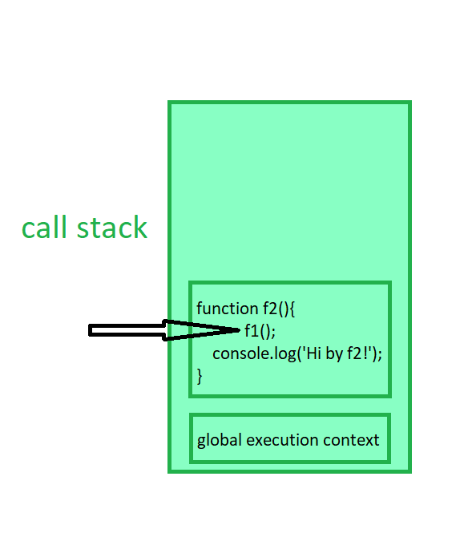

# JavaScript Overview

## Scripting Language
JavaScript is a scripting language that enables you to dynamically update content, control media, and create animated images.
JavaScript is high-level interpreted programming language that used to make a interactive web pages.

Key features :
Client : Run on the browser , no need to contact to the server for every interaction.


### Types of Execution:
- **Synchronous Language**: 
  - Tasks are performed sequentially, meaning one task is complete before the next starts.
  - Execution blocks until the current task finishes.
  - Example: Waiting in a queue, reading a file sequentially.
  
- **Asynchronous Language**:
  - Tasks can run independently of one another.
  - A task can start before the previous task is finished.
  - Non-blocking execution, tasks can run in parallel or handle delays (e.g., waiting for data).
  - Example: Sending a message and continuing other tasks without waiting for a reply.

**Ideal for input/output operations, network requests, and any task that involves waiting.**

### Execution Context in JavaScript
Everything in JavaScript happens inside an execution context.

JavaScript is a **synchronous** (specific order) **single-threaded** (executes one command at a time) language.

#### Key Concepts of Execution Context:
1. **Creation Phase and Execution Phase**:
    - **Creation Phase**: Memory is allocated for variables and functions; variables are initialized with `undefined`.
    - **Execution Phase**: Code is executed line by line; variables are assigned actual values.

2. **Types of Execution Context**:
    - **Global Execution Context**: 
      - Created when the program starts.
      - Manages global variables and functions.
      - There is only one global context.
    - **Function Execution Context**:
      - Created whenever a function is called.
      - Manages variables and function scope locally.
      - Multiple function contexts can exist.
    - **Eval Execution Context**:
      - Created when the `eval()` function is executed (rarely used).

3. **Execution Stack (Call Stack)**:
    - Execution contexts are stored in a call stack.
    - When a function is called, a new execution context is created and pushed onto the call stack.
    - When a function finishes, its execution context is popped off the stack.
    - The call stack maintains the order of execution of execution contexts.

    

---

### Hoisting in JavaScript
In JavaScript, you can use variables and functions before declaring them in the code.

#### Golden Point:
- Variable declarations are scanned and initialized with `undefined`.
- Function declarations are scanned and made available.

#### Examples of Hoisting:
**In case of `var`:**
```javascript
console.log(x);  // undefined
var x = 10;
console.log(x);  // 10
```
**In case of `let` and `const`:**
```javascript
console.log(x);  // ReferenceError
console.log(y);  // ReferenceError
let x = 10;
const y = 20;
console.log(x);  // 10
console.log(y);  // 20
```
**Function Hoisting:**
```javascript
SayHello();  // "Hello"
function SayHello() {
    console.log("Hello");
}
```

**In another way (using an arrow function):**
```javascript
greet();  // TypeError: greet is not a function
console.log(greet);  // undefined
var greet = function () {
    console.log("Hello");
}

getName();  // TypeError: getName is not a function
console.log(getName);  // undefined
var getName = () => {
    console.log("BHAKTI");
}
```
### Summary of Hoisting:
- **var:** `Hoisted` and initialized with `undefined`.
- **let and const:** `Hoisted` but `not initialized`.
- **unction Declarations:** `Fully hoisted` with their definition.
- **Function Expression:** Only the variable is hoisted, not the `function itself`.


# JavaScript Functions and Execution Context

## Functions in JavaScript
A function is a reusable block of code designed to perform a particular task. Functions help structure code better and avoid repetition.

### Example:
```javascript
var x = 1;
a();
b();
console.log(x);

function a() {
  var x = 10;
  console.log(x);
}
function b() {
  var x = 100;
  console.log(x);
}
```

## Memory Execution and Call Stack
During execution, JavaScript follows these steps:
1. **Memory Creation Phase**
   - Allocates memory for variables and functions.
   - Variables are initialized with `undefined`.
2. **Execution Phase**
   - Code runs line by line.
   - Function calls create new execution contexts and push them onto the call stack.

### Call Stack Visualization
```
Call Stack (after a() execution):
-----------------
Global Execution Context
-----------------
```

## Global Execution Context (GEC)
Even an empty JavaScript file creates a Global Execution Context behind the scenes.

### Characteristics:
- `window` object is the global object in the browser.
- `this` in the global context refers to `window`.
- All global variables and functions are stored in the global execution context.
- JavaScript executes code synchronously, following the execution context and call stack mechanism.

### Example:
```javascript
console.log(this == window);  // true

var x = 10;
function greet() {
  console.log("Hello Bhakti");
}

console.log(window.x);       // 10
console.log(window.greet);   // function reference
```

## Undefined vs Not Defined
### Undefined:
Occurs when a variable is declared but not assigned a value.

#### Examples:
```javascript
var y;
console.log(y); // undefined

function test() {}
console.log(test()); // undefined

var obj = {};
console.log(obj.prop); // undefined

var arr = [1, 2, 3];
console.log(arr[5]); // undefined
```

### Not Defined:
Occurs when a variable or function is not declared anywhere.

#### Examples:
```javascript
console.log(z); // ReferenceError: z is not defined

callMe(); // ReferenceError: callMe is not defined

var person;
console.log(person.name); // undefined (person exists but name doesn't)
```

## JavaScript is a Loosely Typed Language
JavaScript does not require explicit type definitions. This means a variable's type can change during execution.

### Example:
```javascript
var data = 10;   // Number
data = "Hello";  // String
console.log(data); // Hello
```

### Additional Characteristics:
- JavaScript automatically converts types when needed (type coercion).
- Weak typing allows greater flexibility but can lead to unexpected results.
- Developers need to be aware of implicit type conversions in comparisons and arithmetic operations.

### Example of Type Coercion:
```javascript
console.log(5 + "5"); // "55" (number converted to string)
console.log("5" - 2); // 3 (string converted to number)
```


## Scope and Lexical Environment
Scope is directly related to the lexical environment.

### Lexical environment = local memory + lexical environment of its parent

1. Whenever an execution context is created, a lexical environment is also created. A lexical environment consists of the local memory along with the lexical environment of its parent. "Lexical" refers to hierarchy or sequence.
2. A function has access to all variables and functions defined in the memory space of its parent lexical environment.
3. The JavaScript engine first searches for a variable in the current local memory space. If it is not found, it looks in the parent lexical environment. This process continues until the variable is found or the lexical environment becomes `null`.
4. This mechanism of searching variables in subsequent lexical environments is known as the **scope chain**. If a variable is not found anywhere, it is considered **not in the scope chain**.

### Example:
```javascript
function outer() {
  var outerVar = "I'm outer";
  function inner() {
    var innerVar = "I'm inner";
    console.log(outerVar); // Accessible due to lexical scope
  }
  inner();
}
outer();
console.log(innerVar); // ReferenceError: innerVar is not defined
```

## Let and Const in JavaScript - Temporal Dead Zone (TDZ)

`let` and `const` are hoisted but cannot be accessed before they are initialized due to the **Temporal Dead Zone (TDZ).**

### Why Does TDZ Occur?
TDZ exists because `let` and `const` are stored in a separate memory space (different from the global execution context). This enforces stricter scoping rules to prevent errors caused by accessing variables before initialization.

### Strictness Levels in JavaScript
`var` << `let` << `const`

### Comparison Table

| Feature              | var | let  | const |
|----------------------|-----|------|-------|
| Hoisting            | Yes | Yes  | Yes   |
| Temporal Dead Zone  | No  | Yes  | Yes   |
| Redeclaration       | Yes | No   | No    |
| Re-initialization   | Yes | Yes  | No    |
| Memory Storage      | GEC | Separate Memory | Separate Memory |

---

- ``var`` no TDZ, can be redeclared and re-initialized , stored in GEC
- ``let`` TDZ applies, can not be redecalred but can be re- initialized, stored n separate memory
- ``const`` TDZ applies , cannot be redeclared or re-initialized, stored in separate memory

## Error Types in JavaScript

1. **Syntax Error** → A compile-time error caused by violations of JavaScript syntax.
```javascript
// Missing closing parenthesis
console.log('Hello World' 
```
2. **Type Error** → A runtime error occurring when attempting invalid operations (e.g., reassigning a constant).

```javascript
const num = 10;
num = 20; // TypeError: Assignment to constant variable.
```

3. **Reference Error** → A runtime error occurring when accessing a variable that is either not defined or not yet initialized.
```javascript
console.log(x); // ReferenceError: x is not defined
let x = 5;
```

# Block Scope in JavaScript

## What is Block Scope?

- A **block** is also known as a **compound statement**.
- Code inside the curly brackets `{}` is called a **block**.
- Multiple statements are grouped inside a block so they can be written where JavaScript expects a **single statement**, such as in `if`, `else`, loops, functions, etc.
- Block values are stored inside separate memory than global. They are stored in `block` `memory`.

- Variables declared with `let` and `const` inside a block are stored in a **separate block memory**, making them **block-scoped**.
- These variables are **not accessible outside the block**.

### Example:

```js
{
  let outer = 100;
  {
    let inner = 200;
    console.log(outer); // 100
    console.log(inner); // 200
  }
  console.log(outer); // 100
  console.log(inner); // ReferenceError: inner is not defined
}
```

---

## Shadowing of Variables using `var`, `let`, and `const`

### What is Shadowing?

- **Shadowing** occurs when a variable inside a block has the same name as a variable outside the block.
- The inner variable **temporarily "shadows"** the outer one within the block.

### Example:

```js
var x = 10; // Global scope
let y = 20; // Script scope
const z = 30; // Script scope

{
  var x = 100; // Global scope (overrides the outer x)
  let y = 200; // Block scope (shadows the outer y)
  const z = 300; // Block scope (redefined inside the block)

  console.log(x); // 100 (overridden globally)
  console.log(y); // 200 (block-scoped y)
  console.log(z); // 300 (block-scoped z)
}

console.log(x); // 100 (modified globally)
console.log(y); // 20 (unaffected by the block-scope shadowing)
console.log(z); // 30 (unaffected by the block-scope shadowing)
```

### Another Example:

```js
let a = 100;
function x() {
  let a = 30;
  console.log(a); // 30 (function scoped)
}
x();
console.log(a); // 100 (global scoped)
```

---

## Illegal Shadowing in JavaScript

Illegal shadowing happens when `let` and `const` variables are shadowed by a `var` declaration inside a block. Since `let` and `const` are block-scoped while `var` is function-scoped or globally scoped, this results in an error.

### Example of Illegal Shadowing:

```js
let y = 10;
{
  var y = 20; // ❌ SyntaxError: Identifier 'y' has already been declared
}
```

However, **shadowing is legal if done correctly**:

```js
let a = 20;
{
  let a = 10; // ✅ Allowed (block-scoped)
}
```

```js
var a = 20;
{
  let a = 10; // ✅ Allowed (block-scoped, does not conflict with var)
}
```

```js
let a = 20;
function x() {
  var a = 10; // ❌ SyntaxError: Identifier 'a' has already been declared
}
```

```js
const a = 20;
{
  const a = 10; // ✅ Allowed (block-scoped)
}
```

---

### Conclusion:
- Use `let` and `const` to **keep variables block-scoped** and avoid accidental overwriting.
- Be cautious with `var` as it **does not follow block scope** and may lead to unintended behavior.
- **Illegal shadowing** can occur when `var` tries to override a `let` or `const` variable inside a block.

# Closures in JavaScript

## What are Closures?

- A **function bundled together with its lexical environment** is called a **closure**.
- Whenever a function is returned, even if it has vanished from the execution context, it **still remembers the reference** it was pointing to.

### Example:

```js
function x() {
  let a = 7;
  function y() {
    console.log(a);
  }
  y();
}
x();
```

### Explanation:

- `y()` is an **inner function** that can access the variable `a` from the **outer function** `x()`.
- This is because `y()` forms a **closure**, retaining access to `a` even after `x()` has finished executing.

---

## Returning a Function

A **closure** allows an inner function to access the variables of its outer function even after execution.

```js
function x() {
  let a = 7;
  function y() {
    console.log(a);
  }
  return y;
}

var z = x(); // x() returns y (with closure)
console.log(z); // Logs function y
z(); // Logs 7 (remembers `a` from x's scope)
```

### Important Notes:

- Whenever a function is returned, it **remembers the reference**, not just the function alone.
- It behaves the same way even with direct function return:

```js
function x() {
  let a = 7;
  return function y() {
    console.log(a);
  };
}

var z = x();
console.log(z); // Logs function y
z(); // Logs 7
```

---

## Corner Case: Variable Modification in Closures

```js
function x() {
  let a = 7;
  function y() {
    console.log(a);
  }
  a = 100; // Modifying `a` before returning `y`
  return y;
}

var z = x();
z(); // Logs 100, not 7 (reference, not value, is preserved)
```

- **Closures store references, not values.**
- Since `a` was changed to `100` before returning `y`, `y()` prints `100`.

---

## Nested Closures (Functions within Functions)

Closures can access variables from multiple nested levels:

```js
function z() {
  let b = 900;
  function x() {
    let a = 7;
    function y() {
      console.log(a, b); // Accessing variables from `x` and `z`
    }
    a = 100;
    y();
  }
  x();
}
z(); // Logs: 100 900
```

- `y()` has access to:
  - `a` from `x()` (parent function).
  - `b` from `z()` (grandparent function).

---

## Uses of Closures

Closures are widely used in JavaScript:

1. **Module Design Pattern** – Encapsulating private variables and methods.
2. **Currying** – Converting a function with multiple arguments into nested functions.
3. **Functions like `once`** – Ensuring a function runs only once.
4. **Memoization** – Caching results for performance optimization.
5. **Maintaining state in an asynchronous world**.
6. **`setTimeout` closures** – Preserving state inside asynchronous functions.
7. **Iterators** – Generating sequences lazily.

Closures are a **powerful feature** in JavaScript, providing **data privacy, state management, and functional programming capabilities**.

# Understanding setTimeout in JavaScript

## How setTimeout Works

1. `setTimeout` stores the function in a different place and attaches a timer to it. When the timer finishes, it rejoins the call stack and executes.

```javascript
function x(){
  let i = 1;
  setTimeout(function() {
    console.log(i);
  });
  console.log("Hello Bhakti");
}
x();

// output 
// Hello Bhakti
// 1
```
## Problem Statement
We want to print `1` after `1` second, `2` after `2 `seconds, and so on.

```javascript
function x(){
  for(var i = 1; i <= 5; i++){
    setTimeout(function (){
        console.log(i);
    },  i * 1000); 
  }
  console.log("Hello Bhakti");
}
x();

```
### Output:

```javascript
Hello Bhakti
6
6
6
6
6

```
### Why Does This Happen?

- This happens due to closure. The function inside `setTimeout` captures the reference of `i`, not its value.

- By the time the `setTimeout` callbacks execute, the loop has already completed, and `i` is `6`.

### Solutions

**1. Using `let` (Block Scope Fix)**

Since `let` has block scope, every iteration creates a new copy of `i`.

```javascript
function x() {
  for (let i = 1; i <= 5; i++) {
    setTimeout(function () {
      console.log(i);
    }, i * 1000);
  }
  console.log("Hello Bhakti");
}
x();
```
### output 
```javascipt
Hello Bhakti
1
2
3
4
5
```
**2. Using a Closure (Works with `var`)**
Since we cannot use `let`, we can create a closure to retain the correct value of `i`.

```javascript
function x() {
  for (var i = 1; i <= 5; i++) {
    function close(j) {
      setTimeout(function () {
        console.log(j);
      }, j * 1000);
    }
    close(i); // Passing `i` as an argument creates a new copy
  }
}
x();
```

### Correct Output

```javascript
1
2
3
4
5
```

### How Does the Closure Fix It?
- The `close(j)` function captures a new value of `i` in each iteration.

- When `setTimeout` executes, it has access to the correct value of `j`.


